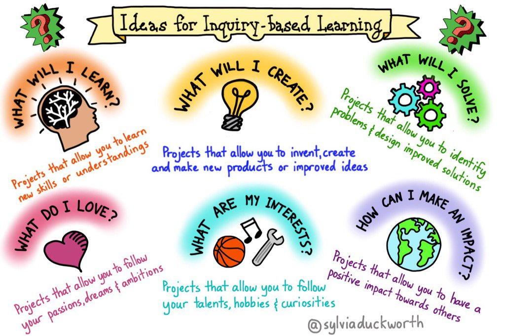
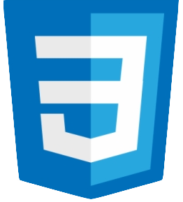

# CONSTRUCTION PROJECT STORYSIM

**WHO:** 
MENTEE [La'Tonia Mertica](https://www.latoniamertica.dev/), arrant curiosity 
MENTOR [Chris](), genius code deconstruction

**WHAT:** 
a _passion project_ conceptualizing project-based learning activities through which mentees - enhanced with mentor guidance - research topics about which they are passionate, inspired, motivated to continue their creative journey... a passion project encourages creativity...promotes perseverance, problem solving, and innovation...
 
 

 
 
**and, logistically speaking,** this journey culminates in the application of technical skills learned, breathing life into an idea

##### &emsp;&emsp;~ _as adapted from_ [Emergent Works Fall Intensive (2023) 'Passion Project Guide'](https://emergentworks.org/programs/)

**WHEN:** 
mentees seldom if ever sleep while materializing their passion project. we are often flush with ideas. startled awake with _try this debug_ and _fine tune that_ thoughts. naively convincing and unconvincing then re-convincing ourselves we can do much much more than is sane on the allotted time table. mentors are zealously lulled along, anchoring the journey in encouragement, expertise, and sensibility...

**WHERE:** 
for me, this cohort, given the weather and available resources - my car, my favorite public library, ...and in my dreams where my code ceaselessly executes in vivid error-free session after session

**HOW:** 
[&#10003;]&emsp;CAMARADERIE  
[&#10003;]&emsp;CANVA  
[&#10003;]&emsp;[GITHUB](https://github.com/LaTonia-Mertica/construction-project-storysim/)  
[&#10003;]&emsp;LOOM  
[&#10003;]&emsp;MAC  
[&#10003;]&emsp;MDN WEB DOCS  
[&#10003;]&emsp;NABC  
[&#10003;]&emsp;PREMIERE PRO  
[&#10003;]&emsp;SLACK  
[&#10003;]&emsp;[TRELLO](https://trello.com/b/61MNau1u/construction-project-storysim)  
[&#10003;]&emsp;VISUAL STUDIO CODE  
[&#10003;]&emsp;W3SCHOOLS  
[&#10003;]&emsp;ZOOM  

[ &nbsp; ]&emsp;AI  

##### **note:** Chris and I discussed the use of artificial intelligence in code/web dev in general and this project.We learned we share some thoughts about the topic, and we agreed to approach this project without it

**TECH STACK** 
 HTML 
 JAVASCRIPT 
 CSS 

**WHY:**
why not. seriously, who doesn't have a chance to code or develop a website and accept. personally, my life has presented a series of seemingly insurmountable obstacles. joining this cohort gave me something positive to look forward to, motivated me to at least try, and introduced me to my mentor - who has graciously been more than a support in code/web dev

**NEXT STEPS:**

- rest for a bit
- fine tune mvp
- update trello
- outline next sprint
- schedule to start
